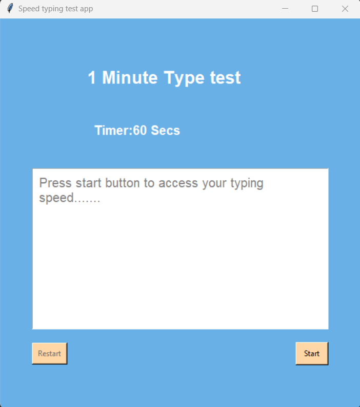
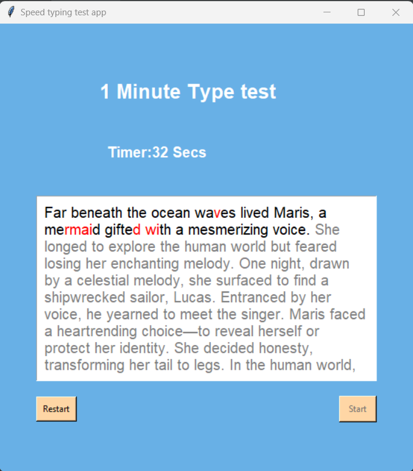
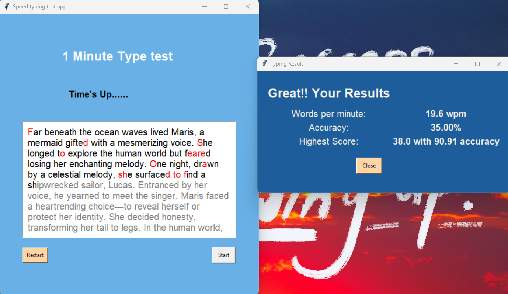

# Speed Typing Test App 🚀

## Overview 📝
This Python application is a speed typing test designed using the Tkinter library. Users can practice their typing skills by typing a given paragraph within a specified time limit(1 minute). The app records the user's words per minute, accuracy, and maintains the highest score.

## Dependencies 🛠️
- Python 3.x
- Tkinter library (usually included with Python installations)

## Features ✨
- Timer display at the top of the application.
- Dynamic paragraph display with color-coded letters (black for correct, red for incorrect).
- Start button to initiate the typing test.
- Reset button to restart the typing test.
- Results window displaying words per minute, accuracy, and highest recorded score.

## Usage 🚀

1. Launch the application.
2. Click on the "Start" button to begin the typing test.
3. Type the given paragraph into the text box.
4. Observe the color-coded changes in the text as you type.
5. After one minute, a results window will pop up with words per minute, accuracy, and the highest recorded score.

#### Note 📌: The calculated Words Per Minute (WPM) and accuracy metrics may slightly differ from other standard typing test applications available on the internet due to variations in calculation methods.

## Working of App 🖥️:

### Interface 🖼️:

### Working 🔄:

### Result 🏆:

